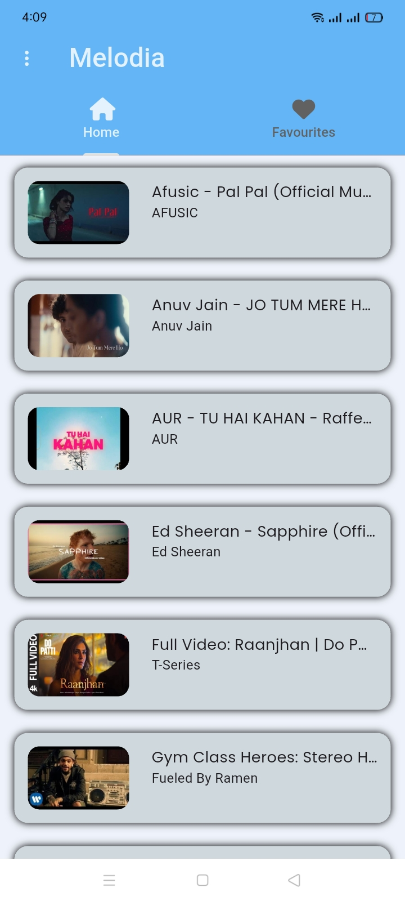
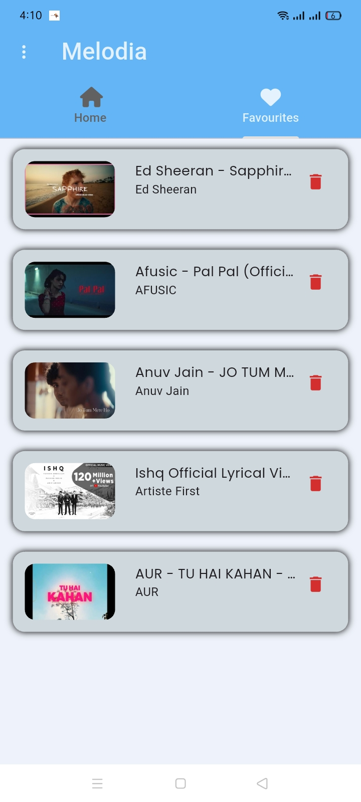
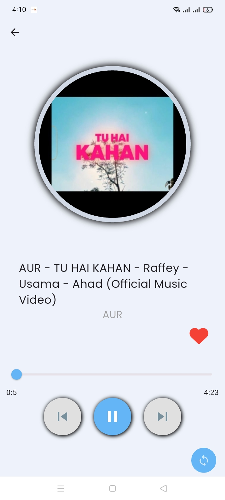
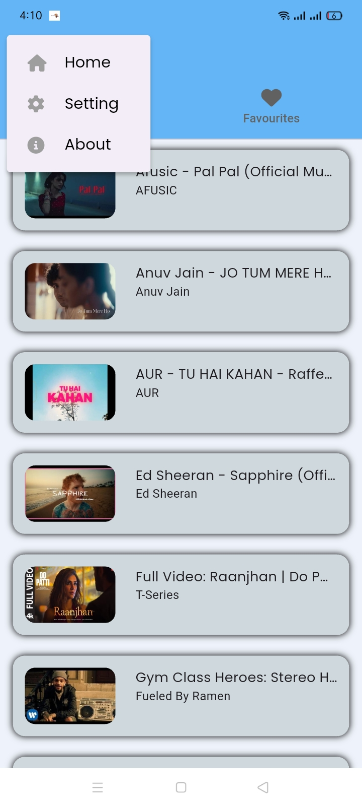
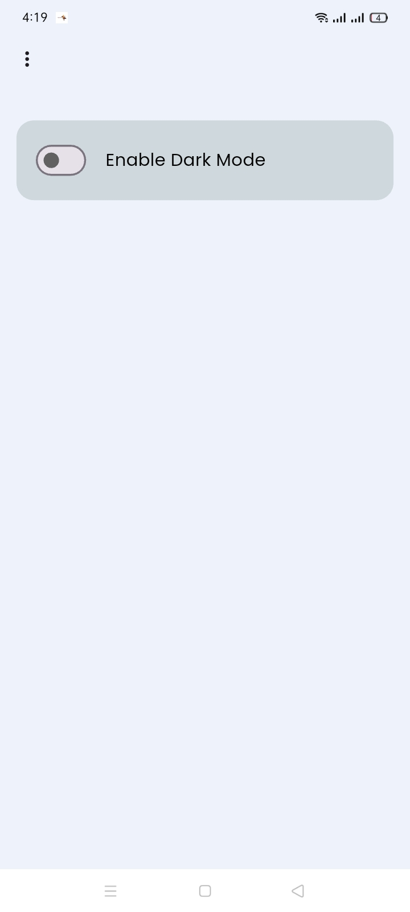
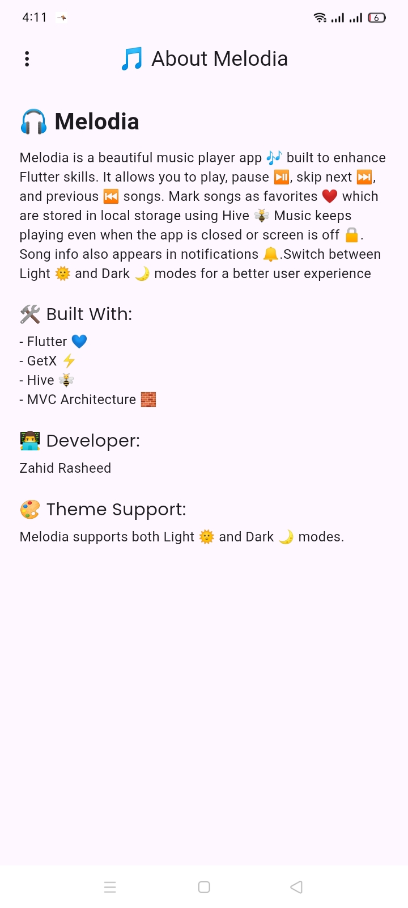
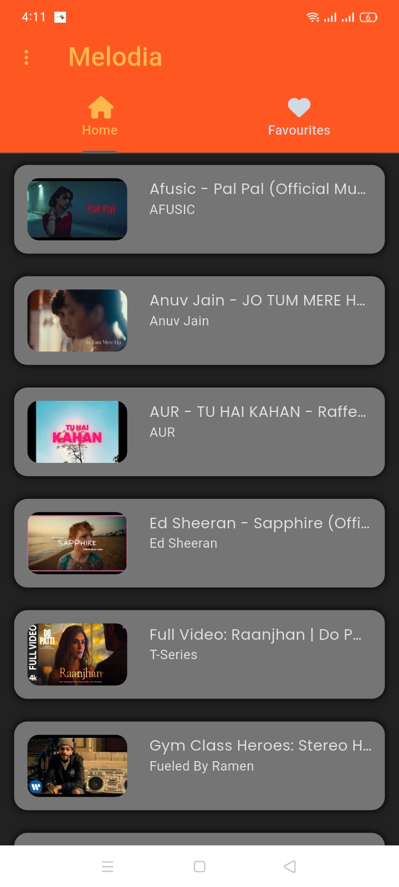
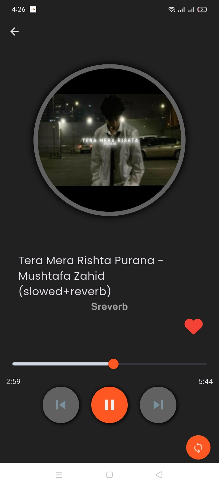

# 🎵 Melodia

**Melodia** is a beautiful music player app 🎶 built to enhance Flutter skills.  
It provides smooth and modern functionality for music lovers with a clean UI/UX.  

---

## ✨ Features
- ⏯️ **Play / Pause** — Enjoy your favorite tracks.
- ⏭️ **Next** / ⏮️ **Previous** song controls.
- 🔁 **Loop Mode** — Repeat your favorite track endlessly.
- ❤️ **Favorites** — Save your favorite songs in local storage using **Hive** 🐝.
- 🔔 **Notification Control** — Song info and playback controls in notifications.
- 🔒 **Background Play** — Music continues even when the app is closed or the screen is off.
- 🌞🌙 **Theme Switching** — Light & Dark mode support.
- ⚡ **GetX State Management** — Fast and reactive UI updates.
- 🧱 **MVC Architecture** — Clean and maintainable code structure.

---

## 🛠 Built With
- **Flutter** 💙  
- **GetX** ⚡  
- **Hive** 🐝  
- **MVC Architecture** 🧱  

---

## 📸 Screenshots  

### 🌞 Light Mode  
| Home | Favorites | Play Screen | Menu |
|------|-----------|-------------|------|
|  |  |  |  |

| Settings | About Screen |
|----------|--------------|
|  |  |

---

### 🌙 Dark Mode  
| Home (Dark) | Play Screen (Dark) |
|-------------|--------------------|
|  |  |

---
